# Phase 1 Comprehensive Datasheet

Generated from `phase1_results.csv`. This report covers Performance, CPU Efficiency, Memory Subsystem, and Signaling.

1 CPU core, 5.3 GHz; PCIe4 x4 = 8GB/s

### Iops Vs Qd

**Insight:** Saturation point identification.

---

### Latency Vs Qd

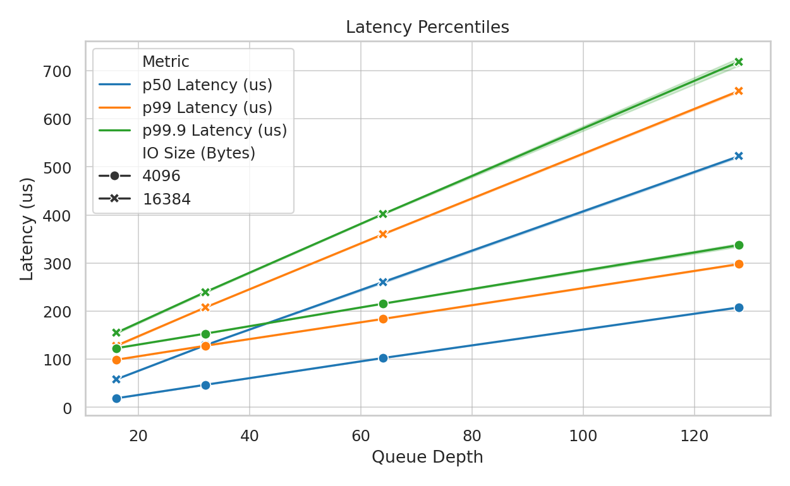

**Insight:** Tail latency characteristics.

---

### Cycles Per Io

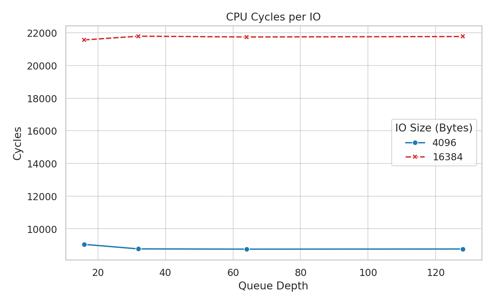

**Insight:** Total CPU cost per IO operation. Lower is better. (total time core active)/(total IOs)

---

### Instr Per Io

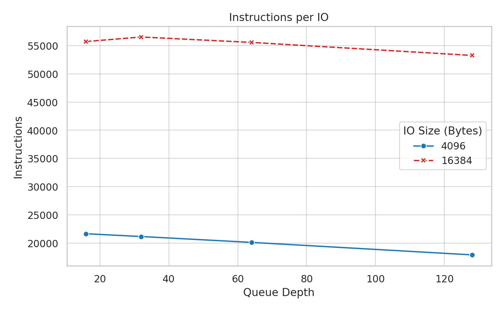

**Insight:** Algorithmic complexity per IO. High values at low QD indicate inefficient polling loops.

---

### Llc Misses Per Io

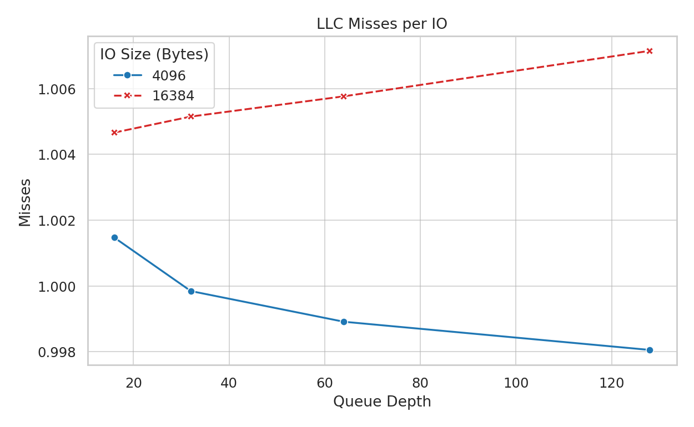

**Insight:** Last-Level Cache pressure. Indicates how much metadata/payload is hitting DRAM.

---

### Dram Bw Per Io

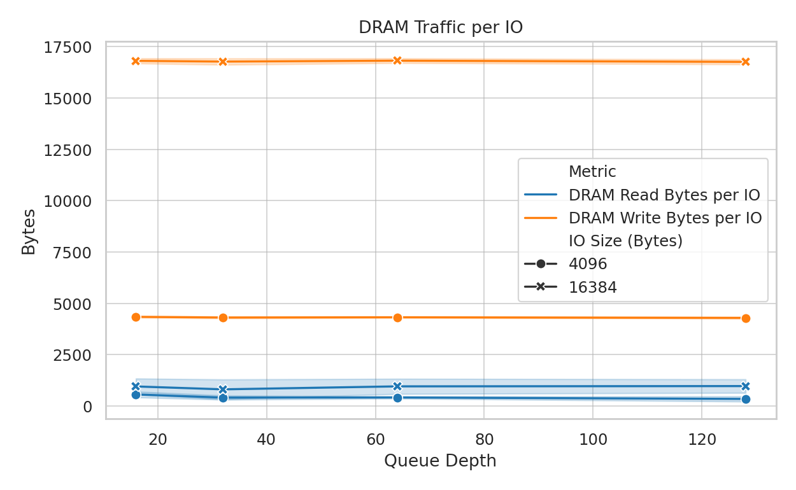

**Insight:** Data movement overhead. Should ideally match payload size, but often exceeds it due to descriptors.

---

### Energy Per Io

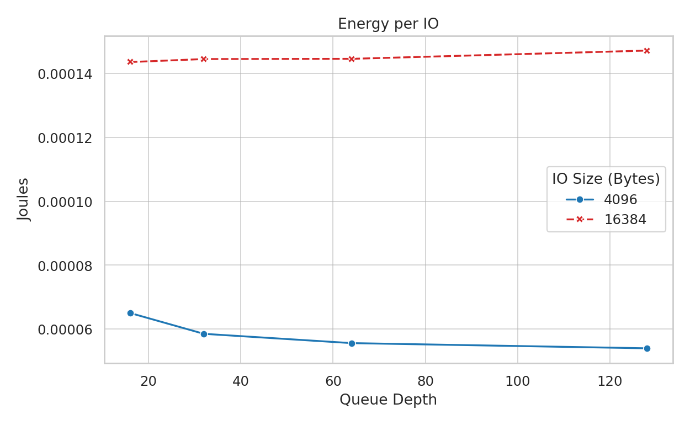

**Insight:** System energy cost per operation. (Note: May include idle power).

---

### Mmio Per Io

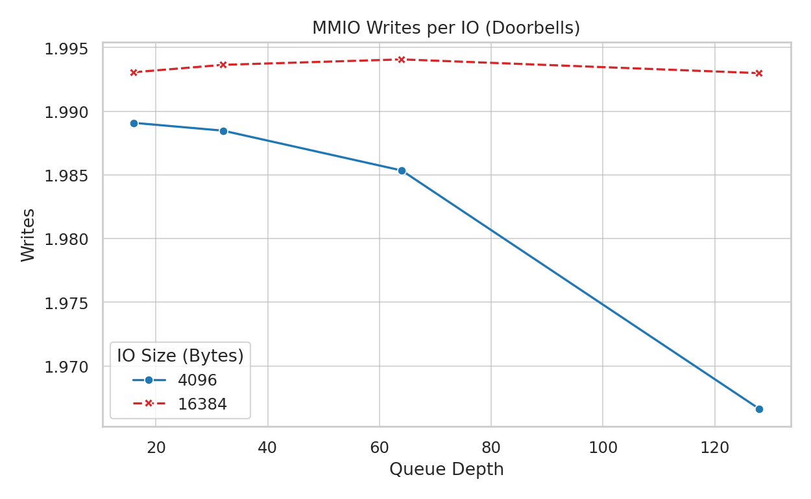

**Insight:** Hardware signaling cost. Values near 2.0 (SQ+CQ) indicate no batching; values < 1.0 indicate batching.

---

### Scans Per Completion

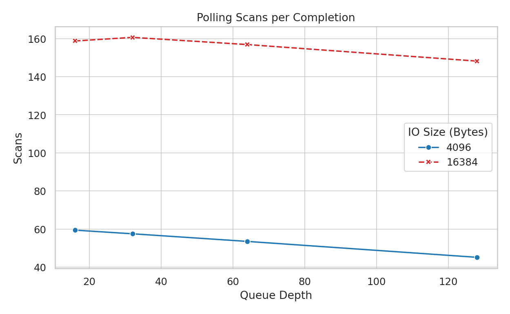

**Insight:** Wasted work metric: How many times the CPU checked an empty ring.

---

### Batch Size

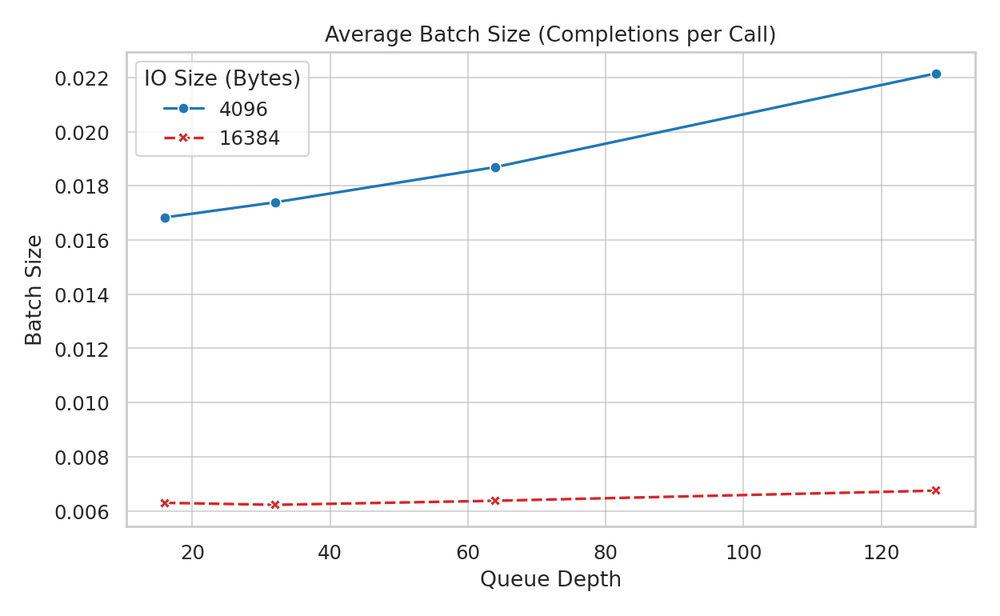

**Insight:** Average number of completions processed when work is actually found.

---

### Stage Breakdown 4K

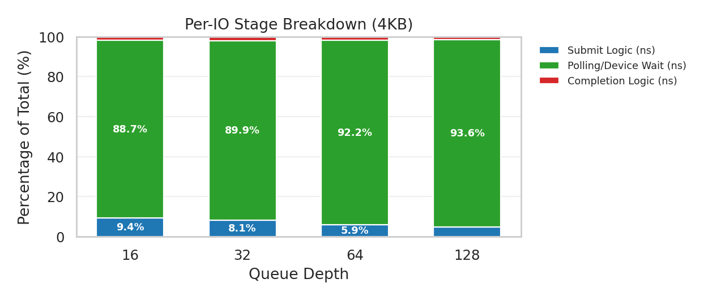

**Insight:** Submit logic:
Allocation: Getting the next free slot in the SQ.
Construction: Constructing and copying the 64B SQE into the SQ.
Barrier: Executing sfence (Write Memory Barrier) so SQE is visible before ringing the doorbell.
MMIO write: SQ tail update.

Polling/Device Wait: time between doorbell ring and completion observed for this IO.

Completion logic:
Detection: Reading the phase bit in the CQE.
D-Cache Invalidation (Implicit): CPU stalls while fetching the CQE line from DDIO/LLC.
Callback: Executing the user's completion callback.
CQ Doorbell: Writing CQ head doorbell (often batched).

---

### Stage Breakdown 16K

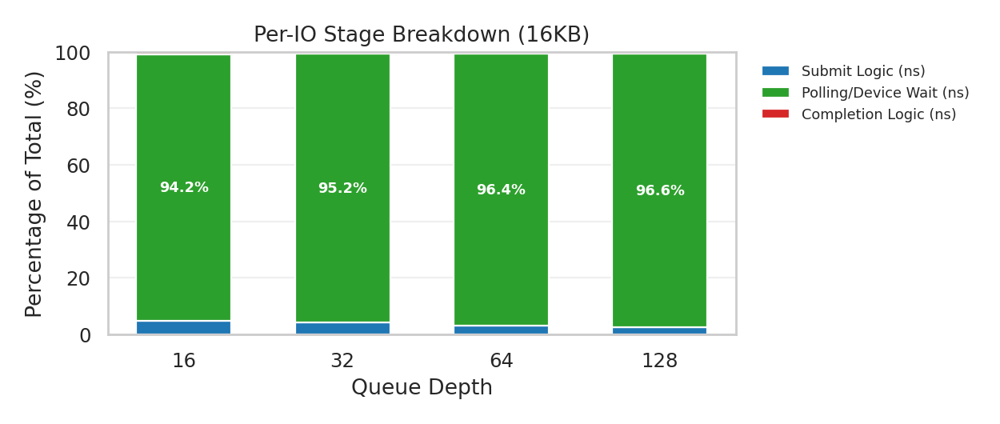

**Insight:** Stacked breakdown of per-IO time (converted to cycles) for 16KB requests.

---

### Submit Stage Breakdown 4K

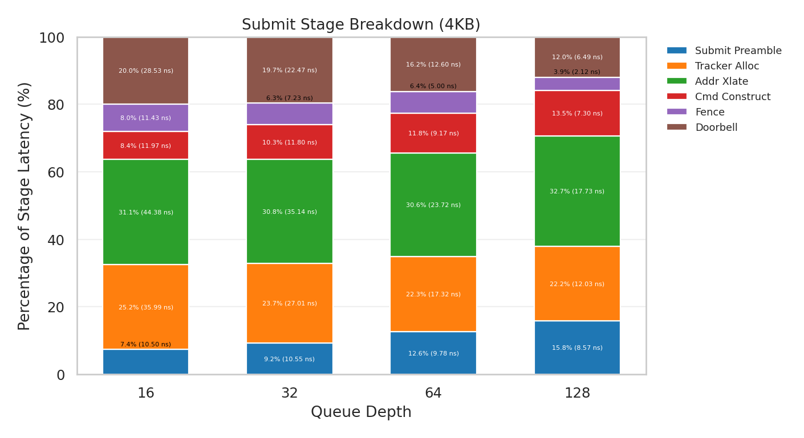

**Insight:** Submit stage percentages and per-step latency for 4KB.

---

### Submit Stage Breakdown 16K

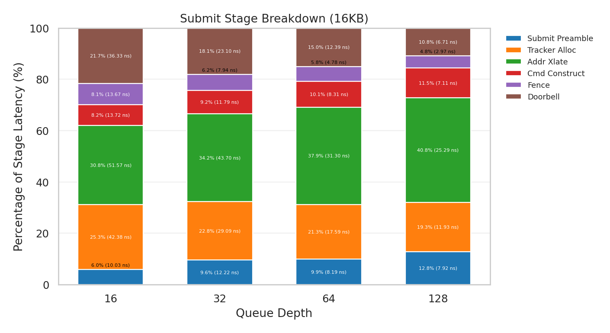

**Insight:** Submit stage percentages and per-step latency for 16KB.

---

### Completion Stage Breakdown 4K

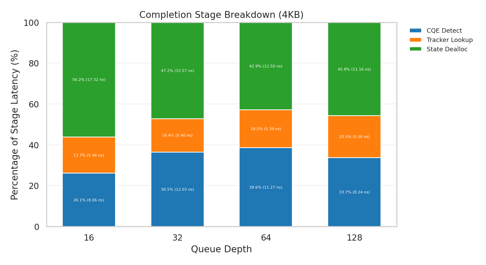

**Insight:** Completion stage percentages and per-step latency for 4KB.

---

### Completion Stage Breakdown 16K

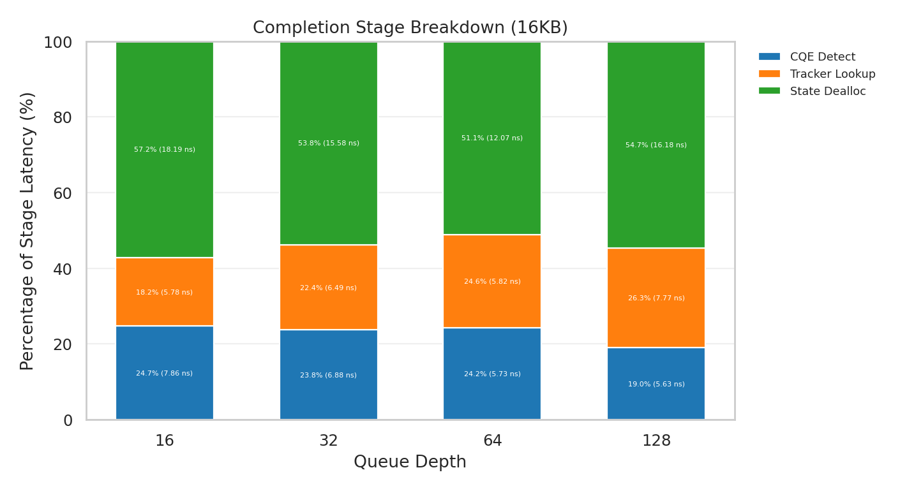

**Insight:** Completion stage percentages and per-step latency for 16KB.

---

### Completions Hist Log

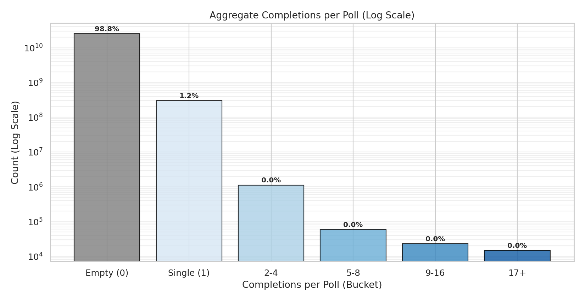

**Insight:** Global distribution of polling outcomes.

---

### Polling Efficiency Qd 4096

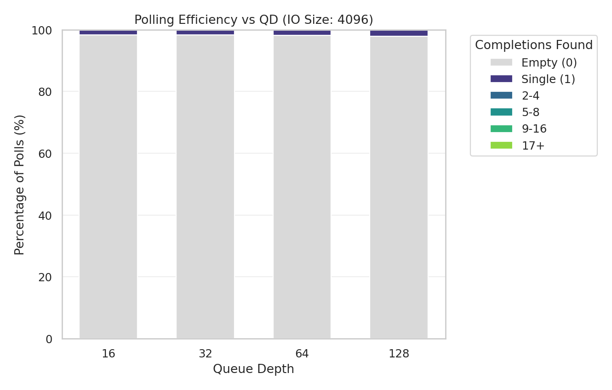

**Insight:** Stacked breakdown of polling outcomes for 4096B IO.

---

### Polling Efficiency Qd 16384

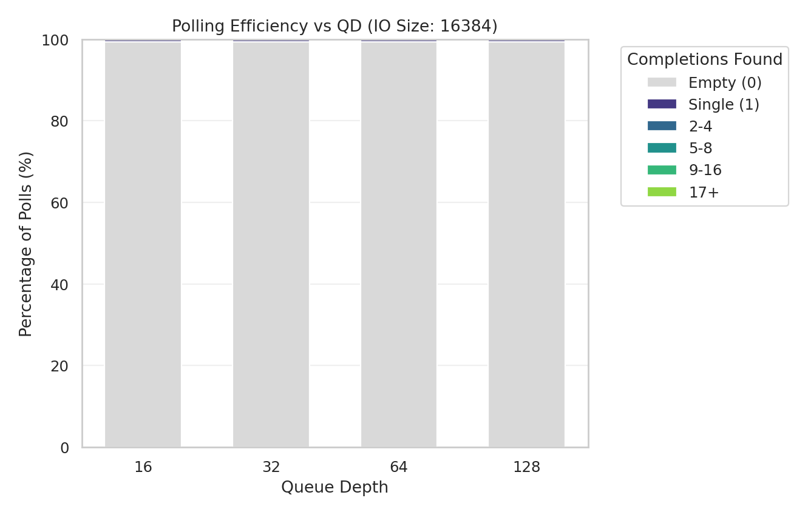

**Insight:** Stacked breakdown of polling outcomes for 16384B IO.

---

